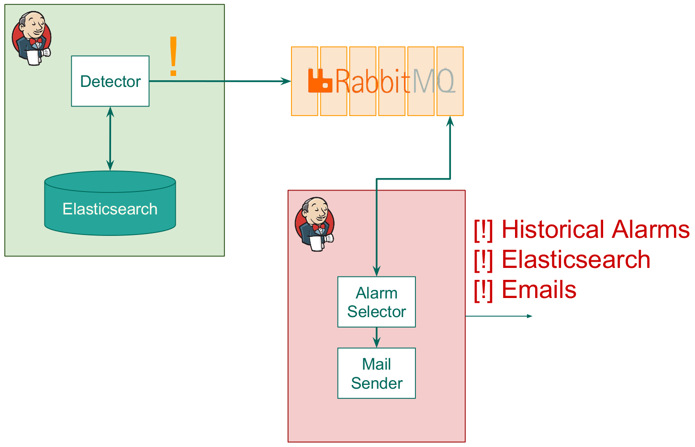

# Alarm System based on Jenkins
This is the complete documentation about the Alarm System based on Jenkins. The main features of this system are the capacity for send alarms to elasticsearch using logstash and visualize them in a dashboard. Also, we use jenkins for send important mails.

## Overview
The full system comprise the alarm notification and visualization, it is implies to send an alarm to elasticsearch using logstash and finally send a email with to alert the respective team. Also, we save an historical alarm file named ```raisedAlarms.log```.

The first module aim to send an alarm to elasticsearch and save the raised alarm in the historical file. This module named ```Alarm Selector```. Then, the second one attendant to send mails using Jenkins templates. This module named ```Alarm Summary Mail Sender```.


Reminding, the figure shows the full system including the Job Manager. The Alarm Selector pulls the alarms from RabbitMQ. Then, the Mail Sender makes a query to elasticsearch for send emails.

An alarm is characterized by a JSON, this JSON  has the following structure:

```json
{
    "@timestamp": "",  /* UTC_millis. Time of the occurrence of event instance   */
    "path"           : "",  /* string. SOME/OPTIONAL/PATH/Name          */   
    "priority"       : "",  /* list. [INFO, WARNING, CRITICAL]          */
    "body"           : {}   /* optional json object, may be empty       */
}
```

## Alarm Selector
The Alarm Selector intizalize credentials. For make this we uncoupled the servers and ports directions. These are in a config file that we passed using the command line. The usage is:

```command
python /path/to/AlarmSelector.py -c /path/to/config.json
```

For example:

```command
python /home/lerko/ComplexBehaviorDetector/AlarmSystem/AlarmSelector.py -c /home/lerko/ComplexBehaviorDetector/AlarmSystem/config.json
```

Then we Initialize credentials using the functions ```args()``` and ```get_conf()```.
```python
def main():
    options = args()
    config = get_conf(options['config_file'])

    ##RabbitMQ
    # Magic Numbers
    credentials = pika.PlainCredentials('myuser', 'mypass')
    rabbitMQHost, rabbitMQPort = config['rabbitmq']['hosts'][0].split(':')
    rabbitMQPort = int(rabbitMQPort)

    ##Logstash
    #Magic Numbers
    logstashHost, logstashPort = config['logstash']['hosts'][0].split(':')
    logstashPort = int(logstashPort)
    logger = initializeLogger(logstashHost, logstashPort)
```
Then, we load the raised IDs, this IDs are a combination of fields path and @timestamp. The function ```getIDs()``` was designed for load the corresponding IDs from the historical raised alarms file.
```python
    ## Alarms control params
    # Editable file path and obtain the IDs
    raisedAlarmsPath = current_dir + '/raisedAlarms.log'
    IDslist = getIDs(raisedAlarmsPath)


    # Raised Alarms
    raisedAlarms = open(raisedAlarmsPath, 'a')
```

Finally, we want to pull the alarms from RabbitMQ.  For this work, we use the ```pika``` python library.

```python
    #Connection as a Blocking Channel
    parameters = pika.ConnectionParameters(rabbitMQHost, rabbitMQPort, '/', credentials)
    connection = pika.BlockingConnection(parameters)

    #Creating channel
    alarmQueue = 'alarm'
    channel = connection.channel()
    channel.queue_declare(queue=alarmQueue)

    for msg in channel.consume(no_ack=True, queue=alarmQueue, inactivity_timeout=1):
        # print msg
        if msg is None:
            break
        method, properties, body = msg
        processingAlarm(IDslist, raisedAlarms, logger, body)
        # print IDslist
```
For close the program, please do not forget close all connections and files.
```python
    ## Close connections
    connection.close()
    raisedAlarms.close()
  ```

  The function ```processingAlarm()``` made all the work, that is mean: Received the log, decided if the alarm must be raised and send the alarm to logstash.

  ```python
  def processingAlarm(IDslist, raisedAlarms, logger, body):
      '''Process the alarm from RabbitMQ.
      This function decide if the alarm must be raised or not.'''
      data = json.loads(body)
      # print data
      ## Compute the unique ID in the appropriated format
      uniqueID = str(data['path']) + '/'+ str(data['@timestamp'])

      # print 'Raised IDs: '+str(IDslist)
      # print 'Current ID: '+uniqueID

      ## If the error has never been raised
      ## then, raise the error.
      if not (uniqueID) in IDslist:
          ## Send to Elasticsearch the alarm
          sendToLogstash(logger, data)

          error = '=== START ERROR: ' + str(data['priority']) + ' ===\n' \
                  'Unique ID: ' + str(data['path'])+'/'+data['@timestamp'] + '\n' \
                  '@timestamp: ' + str(data['@timestamp']) + '\n' \
                  'Name: ' + data['path'] + '\n' \
                  'Priority: ' + str(data['priority']) + '\n' \
                  'Body: ' + str(data['body']) + '\n' \
                  '=== END ERROR ===\n'
          ## Printing in stdout
          print error
          ## Save the alarm
          raisedAlarms.write(error)
          IDslist.append(uniqueID)
```

## Alarm Summary Mail Sender
The email sender is based on the *Email Extension Template Plugin* of Jenkins. This plugins offer the possibility of raise alarms if an regular expression appears in the Jenkins standard output.

The module was made by Marcelo Jara (see [alma-buckets](https://github.com/mijara/alma-buckets)). The philosophy behind this module is create a **Bucket** for recollecting the interested data. Each *bucket* attempt to an specific type of log. For example, the ```PrefixBucket()``` search an specific prefix in the field ```path```.

The propose of this module is printing the information in a fancy style for send a email to a recipient list using Jenkins.

An example of the standard output of this job is the following:

```command
==== BEGIN OVERVIEW ====
CRITICAL: 14
WARNING: 17
==== END OVERVIEW ====
==== BEGIN PREFIX 'ONLINE' ====
2017-02-17T18:00:00.987Z CRITICAL ONLINE/DOCKER/ONELINER/ZBAXH6 :: {"text": "Test Alarm"}
2017-02-17T18:00:01.039Z WARNING ONLINE/ISSUES/MULTILINER/CQ0YOG :: {"text": "Test Alarm"}
2017-02-17T18:00:01.062Z WARNING ONLINE/DOCKER/MULTILINER/0DJJ7F :: {"text": "Test Alarm"}
2017-02-17T18:00:01.069Z CRITICAL ONLINE/DOCKER/MULTILINER/WXS18K :: {"text": "Test Alarm"}
2017-02-17T18:00:01.075Z WARNING ONLINE/DOCKER/MULTILINER/PYI4TJ :: {"text": "Test Alarm"}
2017-02-17T18:00:01.088Z WARNING ONLINE/ISSUES/ONELINER/623177 :: {"text": "Test Alarm"}
2017-02-17T18:00:01.095Z CRITICAL ONLINE/DOCKER/ONELINER/9XAEID :: {"text": "Test Alarm"}
2017-02-17T18:00:01.108Z WARNING ONLINE/ISSUES/ONELINER/QJDVZF :: {"text": "Test Alarm"}
2017-02-17T18:00:01.122Z CRITICAL ONLINE/ISSUES/ONELINER/1F0UK2 :: {"text": "Test Alarm"}
2017-02-17T18:00:01.128Z WARNING ONLINE/DOCKER/ONELINER/9THPOG :: {"text": "Test Alarm"}
2017-02-17T18:00:01.139Z CRITICAL ONLINE/DOCKER/ONELINER/C6SIP6 :: {"text": "Test Alarm"}
2017-02-17T18:00:01.181Z WARNING ONLINE/ISSUES/ONELINER/DS5RU2 :: {"text": "Test Alarm"}
2017-02-17T18:00:01.187Z WARNING ONLINE/ISSUES/ONELINER/QL6EW8 :: {"text": "Test Alarm"}
2017-02-17T18:00:01.204Z CRITICAL ONLINE/DOCKER/MULTILINER/L90ROK :: {"text": "Test Alarm"}
2017-02-17T18:00:01.209Z CRITICAL ONLINE/DOCKER/ONELINER/T52H7N :: {"text": "Test Alarm"}
2017-02-17T18:00:01.214Z CRITICAL ONLINE/DOCKER/MULTILINER/2QIKG0 :: {"text": "Test Alarm"}
2017-02-17T18:00:01.220Z CRITICAL ONLINE/DOCKER/ONELINER/CM4AU4 :: {"text": "Test Alarm"}
2017-02-17T18:00:01.238Z CRITICAL ONLINE/ISSUES/ONELINER/RQLU3X :: {"text": "Test Alarm"}
2017-02-17T18:00:01.243Z WARNING ONLINE/DOCKER/MULTILINER/WLLJPA :: {"text": "Test Alarm"}
2017-02-17T18:00:01.259Z CRITICAL ONLINE/DOCKER/MULTILINER/OKL9I5 :: {"text": "Test Alarm"}
==== END PREFIX 'ONLINE' ====
==== BEGIN PREFIX 'OFFLINE' ====
2017-02-17T18:00:00.999Z WARNING OFFLINE/ISSUES/MULTILINER/76RED7 :: {"text": "Test Alarm"}
2017-02-17T18:00:01.022Z WARNING OFFLINE/ISSUES/ONELINER/SEJ62W :: {"text": "Test Alarm"}
2017-02-17T18:00:01.044Z WARNING OFFLINE/ISSUES/MULTILINER/34NRIL :: {"text": "Test Alarm"}
2017-02-17T18:00:01.050Z WARNING OFFLINE/ISSUES/MULTILINER/YJTEBA :: {"text": "Test Alarm"}
2017-02-17T18:00:01.101Z CRITICAL OFFLINE/ISSUES/MULTILINER/384S7F :: {"text": "Test Alarm"}
2017-02-17T18:00:01.116Z WARNING OFFLINE/ISSUES/ONELINER/JQ4CS0 :: {"text": "Test Alarm"}
2017-02-17T18:00:01.145Z WARNING OFFLINE/ISSUES/ONELINER/0CTJIB :: {"text": "Test Alarm"}
2017-02-17T18:00:01.156Z CRITICAL OFFLINE/ISSUES/ONELINER/BO7UVT :: {"text": "Test Alarm"}
2017-02-17T18:00:01.169Z WARNING OFFLINE/ISSUES/ONELINER/NN8R4T :: {"text": "Test Alarm"}
2017-02-17T18:00:01.176Z WARNING OFFLINE/ISSUES/MULTILINER/7EIHCH :: {"text": "Test Alarm"}
2017-02-17T18:00:01.192Z CRITICAL OFFLINE/ISSUES/MULTILINER/ZR9ROE :: {"text": "Test Alarm"}
==== END PREFIX 'OFFLINE' ====
```

Then we detect the strings ```==== BEGIN OVERVIEW ====```, ```==== BEGIN PREFIX 'ONLINE' ====``` and ```==== BEGIN PREFIX 'OFFLINE' ====``` for trigger emails. The usage of this module is given by:

```command
usage: main.py [-h] [-l LAST] [-f FROM_TIME] [-t TO_TIME] [-c CONFIG]
               [-p MIN_PRIORITY]
               query

positional arguments:
  query                 Query string as written in Kibana.

optional arguments:
  -h, --help            show this help message and exit
  -l LAST, --last LAST  Time to query ES for last logs, overrides from/to.
                        Example: 1s, 1m, 2h, 3d, 5w
  -f FROM_TIME, --from-time FROM_TIME
                        Time lower limit in UTC
  -t TO_TIME, --to-time TO_TIME
                        Time upper limit in UTC
  -c CONFIG, --config CONFIG
                        Config file path
  -p MIN_PRIORITY, --min-priority MIN_PRIORITY
                        Minimum priority to fetch.
```
